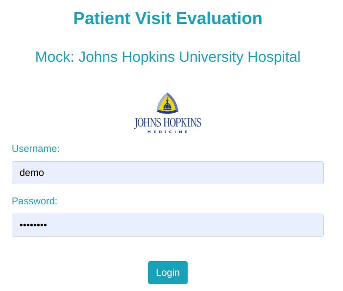
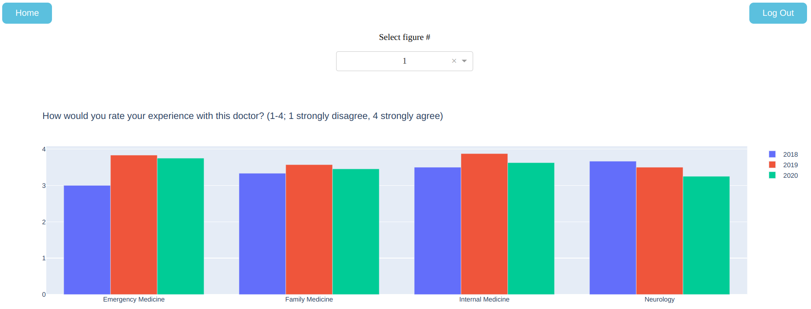

# Interactive Data Visualization Dashboard

A data visualization dashboard template powered by flask, Dash/Plotly etc.

## Testing

- Activate venv
- Install dependencies: `pip3 install -r requirements.txt`
- Run `python3 -m pytest` to run tests
- If all tests passed, launch the app in debugger and you will see the following:

### Login screen (username: demo; password: password)  

  

### Main dashboard  

## [Explanation](./doc/index.MD)